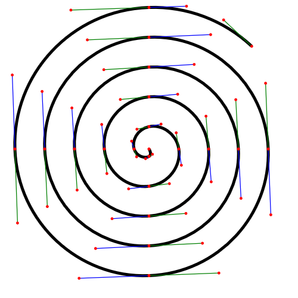

# HallsByra.BezierSpiral
An algorithm that generates approximations of Archimedean (arithmetic) spirals as a series of cubic Bézier curves.

The control points of the Bèzier curves are calculated as described in [this Stack Overflow answer](https://stackoverflow.com/a/27863181) answer. That question is really about approximating circles, but the method seems to render pretty good results for spirals too.

## Example

